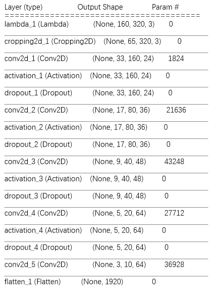
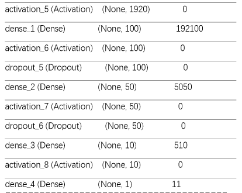
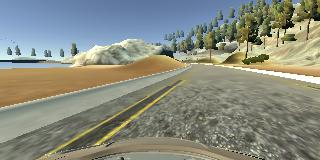

# **Behavioral Cloning** 
---

**Behavioral Cloning Project**

The goals / steps of this project are the following:
* Use the simulator to collect data of good driving behavior
* Build, a convolution neural network in Keras that predicts steering angles from images
* Train and validate the model with a training and validation set
* Test that the model successfully drives around track one without leaving the road
* Summarize the results with a written report


[//]: # (Image References)

[image1]: ./examples/placeholder.png "Model Visualization"
[image2]: ./examples/placeholder.png "Grayscaling"
[image3]: ./examples/placeholder_small.png "Recovery Image"
[image4]: ./examples/placeholder_small.png "Recovery Image"
[image5]: ./examples/placeholder_small.png "Recovery Image"
[image6]: ./examples/placeholder_small.png "Normal Image"
[image7]: ./examples/placeholder_small.png "Flipped Image"

## Rubric Points
### Here I will consider the [rubric points](https://review.udacity.com/#!/rubrics/432/view) individually and describe how I addressed each point in my implementation.  

---
### Files Submitted & Code Quality

#### 1. Submission includes all required files and can be used to run the simulator in autonomous mode

My project includes the following files:
* model.py containing the script to create and train the model
* drive.py for driving the car in autonomous mode
* model.h5 containing a trained convolution neural network 
* writeup_report.md summarizing the results

#### 2. Submission includes functional code
Using the Udacity provided simulator and my drive.py file, the car can be driven autonomously around the track by executing 
```sh
python drive.py model.h5
```

#### 3. Submission code is usable and readable

The model.py file contains the code for training and saving the convolution neural network. The file shows the pipeline I used for training and validating the model, and it contains comments to explain how the code works.

### Model Architecture and Training Strategy

#### 1. An appropriate model architecture has been employed

My model consists of a convolution neural network with 5x5 and 3x3 filter sizes and depths between 24 and 64 (model.py lines 109-123) 

The model includes RELU layers to introduce nonlinearity (code line 110 , 115 ...), and the data is normalized in the model using a Keras lambda layer (code line 104). 

#### 2. Attempts to reduce overfitting in the model

The model contains dropout layers in order to reduce overfitting (model.py lines 113,116,119 ...). 

The model was trained and validated on different data sets to ensure that the model was not overfitting (code line 157,211). The model was tested by running it through the simulator and ensuring that the vehicle could stay on the track.

#### 3. Model parameter tuning

The model used an default adam optimizer, so the learning rate was not tuned manually (model.py line 136).
In the finetune step, use a lower learning rate adam optimizer (model.py line 202) to avoid break the initial trained parameters.

#### 4. Appropriate training data

Training data was chosen to keep the vehicle driving on the road. I used a combination of center lane driving, recovering from the left and right sides of the road.

For details about how I created the training data, see the next section. 

### Model Architecture and Training Strategy

#### 1. Solution Design Approach

The overall strategy for deriving a model architecture was to copy the Nvidia pipeline.

My first step was to use a convolution neural network model similar to the network from Nvidia paper "End to End Learning for Self-DrivingCars".

I thought this model might be appropriate because in paper, authors show they sucessfully used 'the network' to predict steering angle and made good performence.

In order to gauge how well the model was working, I split my image and steering angle data into a training and validation set. 

I found that my first model had a low mean squared error  on both the training set and the validation set.

This implied that the model was smart to learn the driving behavior, but there were a few spots where the vehicle fell off the track especially where there is sharp turn. 

To improve the driving behavior in these bad cases, I record new data (images in IMG_FINETUNE.mp4) to add to train dataset. 

The images in IMG_FINETUNE.mp4 contains the opearations which recover car from left or right side of road back to center.

At the end of the process, the vehicle is able to drive autonomously around the track without leaving the road.

#### 2. Final Model Architecture

The final model architecture (model.py lines 109-123) consisted of a convolution neural network with the following layers.

Here is a visualization of the architecture:

 



#### 3. Creation of the Training Set & Training Process

To capture good driving behavior, I use the sample data [Sample Training Data](https://d17h27t6h515a5.cloudfront.net/topher/2016/December/584f6edd_data/data.zip) of center lane driving. Here is an example image of center lane driving:


I then recorded the vehicle recovering from the left side and right sides of the road back to center so that the vehicle would learn to recover from  left side and right side back to center.

These images show what a recovery looks like starting from :




To augment the data sat, I also flipped images and angles thinking that this would lower the turn left bias. For example, here is an image that has then been flipped:


After the collection process, I had 18726 number of data points(showed in IMG_FINETUNE.mp4) for tuning model.

I finally randomly shuffled the data set and put 30% of the data into a validation set. 

I used this training data for training the model. The validation set loss seems lower by each epoch step which means the model was successfully trained. 

The ideal number of epochs when train initial model wae 4 enough because after training ,model has a good performence. when in finetune step the ideal number of epochs was 8 because the learning rate was set very slow (0.0001) which result a low validate data loss.
