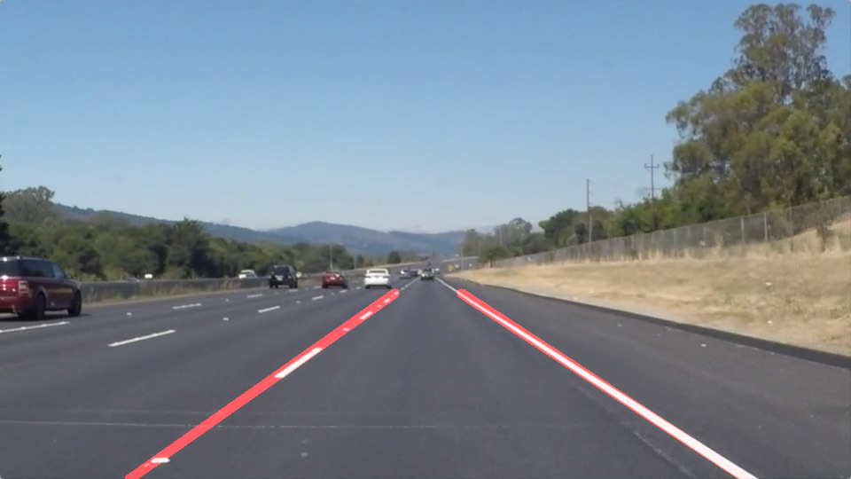

# **Finding Lane Lines on the Road** 

---

**Finding Lane Lines on the Road**

The goals / steps of this project are the following:
* Make a pipeline that finds lane lines on the road
* Reflect on your work in a written report

[//]: # (Image References)

[image1]: ./examples/grayscale.jpg "Grayscale"

---

### Reflection

### 1. Describe your pipeline. As part of the description, explain how you modified the draw_lines() function.

My pipeline consisted of 5 steps. 
1. Reading in an image
2. Define a kernel size and apply Gaussian smoothing
3. Canny Edge Detection
4. Create a masked edges image 
5. Detect lines via Hough Transformations
6. Draw the lane lines onto the original image

In order to draw a single line on the left and right lanes, I modified the draw_lines() function by ...

### 2. Identify potential shortcomings with your current pipeline

One potential shortcoming would be what would happen when ... 

Another shortcoming could be ...

### 3. Suggest possible improvements to your pipeline

A possible improvement would be to ...

Another potential improvement could be to ...
